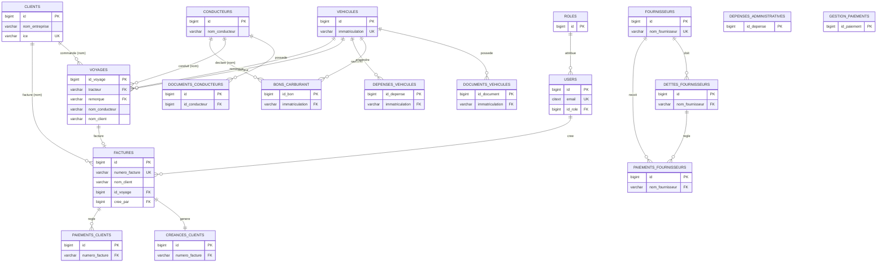

# ÉTAPE 2 — Conception complète de la base de données PostgreSQL (VALIDÉE)

> Document de **conception uniquement** — aucun script SQL généré à ce stade.
> Modèle final après arbitrages du 12/07/2026 :
> **(1)** références par **nom** conservées (avec FK sur clés naturelles uniques) ·
> **(2)** `FACTURES` **normalisée** via `id_voyage` ·
> **(3)** table **`FOURNISSEURS`** dédiée ajoutée → **18 tables**.

---

## 1. Cohérence du modèle métier

```
CLIENT ──► VOYAGE (tracteur + remorque + conducteur) ──► CARBURANT / DÉPENSES
              │
              ▼
          FACTURE ──► CRÉANCE ◄── PAIEMENTS_CLIENTS
FOURNISSEUR ──► DETTE ◄── PAIEMENTS_FOURNISSEURS
USERS ─(id_role)─ ROLES        GESTION_PAIEMENTS = échéancier transversal
```

Chaque flux financier est rattaché à son fait générateur. Modèle cohérent, sans entité orpheline.

---

## 2. Liste finale des 18 tables

| # | Table | Rôle |
|---|---|---|
| 1 | USERS | Comptes & accès |
| 2 | ROLES | Rôles applicatifs |
| 3 | CLIENTS | Donneurs d'ordre |
| 4 | CONDUCTEURS | Chauffeurs |
| 5 | VEHICULES | Tracteurs & remorques |
| 6 | DOCUMENTS_VEHICULES | Papiers véhicules |
| 7 | DOCUMENTS_CONDUCTEURS | Papiers conducteurs |
| 8 | VOYAGES | Missions de transport |
| 9 | BONS_CARBURANT | Pleins de carburant |
| 10 | DEPENSES_VEHICULES | Frais par véhicule |
| 11 | DEPENSES_ADMINISTRATIVES | Frais généraux |
| 12 | FACTURES | Factures clients |
| 13 | CREANCES_CLIENTS | Encours clients |
| 14 | PAIEMENTS_CLIENTS | Encaissements |
| 15 | **FOURNISSEURS** *(nouvelle)* | Référentiel fournisseurs |
| 16 | DETTES_FOURNISSEURS | Dettes fournisseurs |
| 17 | PAIEMENTS_FOURNISSEURS | Décaissements |
| 18 | GESTION_PAIEMENTS | Échéancier de trésorerie |

---

## 3. Stratégie de liaison retenue

| Type de lien | Traitement | Exemples |
|---|---|---|
| Clé naturelle **unique** | **FK réelle** | `immatriculation` → vehicules ; `numero_facture` → factures ; `nom_fournisseur` → fournisseurs |
| Identifiant technique | **FK réelle** | `id_role` → roles ; `id_conducteur` → conducteurs ; `id_voyage` → voyages ; `cree_par` → users |
| Référence par **nom non unique** | Colonne **indexée sans FK** | `nom_client`, `nom_conducteur` (dans voyages, bons, factures, créances, paiements) |

> **Décision (1)** : on conserve les colonnes-noms de la spécification. Les FK ne sont posées que
> sur les cibles réellement uniques ; les noms de personnes/clients restent des colonnes indexées
> (l'intégrité de ces liens sera assurée côté applicatif via des listes déroulantes).

### Normalisation
- **1NF** : colonnes atomiques. **2NF** : clés primaires simples, pas de dépendance partielle.
- **3NF** : appliquée pleinement à `FACTURES` (§6) et via l'extraction de **`FOURNISSEURS`**.
  Les colonnes-noms conservées (décision 1) et les détails recopiés de `CREANCES_CLIENTS`
  (spec) constituent une **dénormalisation contrôlée assumée** au profit de la simplicité de
  saisie et de l'immuabilité comptable.

---

## 4. Clés primaires (surrogate auto-incrément, noms de la spécification)

| Table | PK |  | Table | PK |
|---|---|---|---|---|
| roles | id | | factures | id |
| users | id | | creances_clients | id |
| clients | id | | paiements_clients | id |
| conducteurs | id | | **fournisseurs** | **id** |
| vehicules | id | | dettes_fournisseurs | id |
| documents_vehicules | id_document | | paiements_fournisseurs | id |
| documents_conducteurs | id | | gestion_paiements | id_paiement |
| voyages | id_voyage | | bons_carburant | id_bon |
| depenses_vehicules | id_depense | | depenses_administratives | id_depense |

---

## 5. Clés étrangères & actions ON DELETE / ON UPDATE

| Table.colonne | → Référence | ON DELETE | ON UPDATE | Justification |
|---|---|---|---|---|
| users.id_role | roles.id | RESTRICT | CASCADE | Rôle utilisé protégé |
| documents_vehicules.immatriculation | vehicules.immatriculation | CASCADE | CASCADE | Docs liés au véhicule |
| documents_conducteurs.id_conducteur | conducteurs.id | CASCADE | CASCADE | Docs liés au conducteur |
| voyages.tracteur | vehicules.immatriculation | SET NULL | CASCADE | Véhicule réformé, voyage conservé |
| voyages.remorque | vehicules.immatriculation | SET NULL | CASCADE | idem |
| bons_carburant.immatriculation | vehicules.immatriculation | RESTRICT | CASCADE | Traçabilité coûts |
| depenses_vehicules.immatriculation | vehicules.immatriculation | RESTRICT | CASCADE | Traçabilité coûts |
| factures.id_voyage | voyages.id_voyage | SET NULL | CASCADE | Facture survit au voyage |
| factures.cree_par | users.id | SET NULL | CASCADE | Audit |
| creances_clients.numero_facture | factures.numero_facture | CASCADE | CASCADE | 1 créance ↔ 1 facture |
| paiements_clients.numero_facture | factures.numero_facture | RESTRICT | CASCADE | Historique protégé |
| dettes_fournisseurs.nom_fournisseur | fournisseurs.nom_fournisseur | RESTRICT | CASCADE | Fournisseur référencé |
| paiements_fournisseurs.nom_fournisseur | fournisseurs.nom_fournisseur | RESTRICT | CASCADE | idem |

**Colonnes dérivées** (générées / vues / calcul applicatif) :
- `factures.date_echeance` = `date_facture + jours_echeance` → **générée**
- `factures.montant_tva` = `sous_total × taux_tva/100` → **générée**
- `factures.montant_total` = `sous_total + montant_tva` → **générée**
- `creances_clients.solde` = `montant_facture − montant_recu` → **générée**
- `dettes_fournisseurs.solde` = `montant_du − montant_paye` → **générée**
- `bons_carburant.montant_total` = `litres × prix_par_litre` → **générée**
- `jours_restants` / `jours_retard` (gestion, dettes) → **calcul applicatif / vue** (dépend de `CURRENT_DATE`)

---

## 6. Normalisation de FACTURES (décision 2)

Colonnes **retirées** car dérivables via `id_voyage` (dépendances transitives éliminées) :
`id_tracteur`, `id_remorque`, `numero_cmr`, `description_trajet`, `date_chargement`.
Le PDF légal reprend ces informations par **jointure** au moment de l'émission.

`FACTURES` conserve : `numero_facture` (U), `nom_client`, `id_voyage` (FK), dates, `devise`,
montants (HT/TVA/TTC générés), `montant_en_lettres`, `chemin_pdf`, audit (`cree_par`, `cree_le`,
`mis_a_jour_le`, `supprime_le`).

---

## 7. Contraintes NOT NULL / UNIQUE / CHECK

- **UNIQUE** : `roles.nom`, `users.email`, `clients.ice`, `vehicules.immatriculation` /
  `numero_chassis`, `factures.numero_facture`, `creances_clients.numero_facture`,
  `fournisseurs.nom_fournisseur`.
- **NOT NULL** : PK, FK obligatoires, libellés d'identité, montants, dates clés.
- **CHECK** : montants ≥ 0 ; `litres > 0` ; paiements > 0 ; `montant_recu ≤ montant_facture` ;
  `montant_paye ≤ montant_du` ; `date_expiration ≥ date_emission` ; `annee 1950–2100` ;
  délais ≥ 0 ; format e-mail.
- **ENUM** pour tous les statuts (§11).

---

## 8. Index de performance

FK (`id_role`, `id_conducteur`, `immatriculation`, `id_voyage`, `numero_facture`,
`nom_fournisseur`) · statuts (`users`, `clients`, `vehicules`, `voyages`, `creances`, `dettes`,
`gestion`) · dates d'expiration (documents) · dates d'échéance (factures, dettes, gestion) ·
recherches (`nom_entreprise`, `immatriculation`, `numero_facture`, `nom_client`) ·
dates de reporting (`date_carburant`, `date_depense`, `date_paiement`).

---

## 9. Relations entre les tables

| Relation | Cardinalité |
|---|---|
| ROLES – USERS | 1 – N |
| USERS – FACTURES (cree_par) | 1 – N |
| CLIENTS – VOYAGES / FACTURES | 1 – N (par nom) |
| CONDUCTEURS – DOCUMENTS_CONDUCTEURS | 1 – N |
| CONDUCTEURS – VOYAGES / BONS_CARBURANT | 1 – N (par nom) |
| VEHICULES – DOCUMENTS_VEHICULES / BONS / DEPENSES | 1 – N (immatriculation) |
| VEHICULES – VOYAGES (tracteur) | 1 – N |
| VEHICULES – VOYAGES (remorque) | 1 – N |
| VOYAGES – FACTURES | 1 – 0..1 (id_voyage) |
| FACTURES – CREANCES_CLIENTS | 1 – 1 (numero_facture) |
| FACTURES – PAIEMENTS_CLIENTS | 1 – N (numero_facture) |
| **FOURNISSEURS – DETTES_FOURNISSEURS** | 1 – N (nom_fournisseur) |
| **FOURNISSEURS – PAIEMENTS_FOURNISSEURS** | 1 – N (nom_fournisseur) |
| DETTES_FOURNISSEURS – PAIEMENTS_FOURNISSEURS | 1 – N (lien logique par facture) |
| GESTION_PAIEMENTS | table transversale, sans FK |

Aucune relation **N‑N** : `tracteur`/`remorque` = deux relations 1‑N distinctes du même véhicule.

---

## 10. Dictionnaire de données

Légende : **PK** · **FK** · **U** unique · **NN** not null · **G** générée/dérivée.

### 10.1 ROLES
| Colonne | Type | Contraintes | Description |
|---|---|---|---|
| id | BIGINT | PK | Identifiant |
| nom | VARCHAR(50) | NN, U | ADMIN/GESTIONNAIRE/COMPTABLE/OPERATEUR/CONDUCTEUR |
| description | VARCHAR(255) | | Libellé |

### 10.2 USERS
| Colonne | Type | Contraintes | Description |
|---|---|---|---|
| id | BIGINT | PK | — |
| nom | VARCHAR(120) | NN | Nom complet |
| email | CITEXT | NN, U, CHECK | Connexion |
| telephone | VARCHAR(30) | | — |
| mot_de_passe | VARCHAR(255) | NN | Hash argon2/bcrypt |
| id_role | BIGINT | FK→roles, NN | Rôle |
| statut | ENUM user_statut | NN, déf. ACTIF | — |
| derniere_connexion | TIMESTAMPTZ | | — |
| cree_le | TIMESTAMPTZ | NN, déf. now() | — |

### 10.3 CLIENTS
| Colonne | Type | Contraintes | Description |
|---|---|---|---|
| id | BIGINT | PK | — |
| nom_entreprise | VARCHAR(150) | NN | Raison sociale |
| ice | VARCHAR(15) | U | ICE Maroc |
| telephone | VARCHAR(30) | | — |
| email | CITEXT | | — |
| adresse | VARCHAR(255) | | — |
| delai_paiement_jours | INTEGER | NN, déf. 30, CHECK ≥0 | Délai accordé |
| limite_credit | NUMERIC(14,2) | NN, déf. 0, CHECK ≥0 | Plafond encours |
| statut | ENUM client_statut | NN, déf. ACTIF | ACTIF/INACTIF/BLOQUE |

### 10.4 CONDUCTEURS
| Colonne | Type | Contraintes | Description |
|---|---|---|---|
| id | BIGINT | PK | — |
| nom_conducteur | VARCHAR(150) | NN | Nom complet |
| telephone | VARCHAR(30) | | — |
| adresse | VARCHAR(255) | | — |
| statut | ENUM conducteur_statut | NN, déf. DISPONIBLE | — |
| cree_le | TIMESTAMPTZ | NN, déf. now() | — |

### 10.5 VEHICULES
| Colonne | Type | Contraintes | Description |
|---|---|---|---|
| id | BIGINT | PK | — |
| immatriculation | VARCHAR(20) | NN, U | Plaque (clé de liaison) |
| marque | VARCHAR(60) | NN | — |
| modele | VARCHAR(60) | | — |
| type_vehicule | VARCHAR(40) | NN | TRACTEUR/REMORQUE/CAMION… |
| annee | SMALLINT | CHECK 1950–2100 | — |
| numero_chassis | VARCHAR(50) | U | VIN |
| capacite_charge | NUMERIC(8,2) | CHECK ≥0 | Tonnage |
| statut | ENUM vehicule_statut | NN, déf. DISPONIBLE | — |
| cree_le | TIMESTAMPTZ | NN, déf. now() | — |

### 10.6 DOCUMENTS_VEHICULES
| Colonne | Type | Contraintes | Description |
|---|---|---|---|
| id_document | BIGINT | PK | — |
| immatriculation | VARCHAR(20) | FK→vehicules, NN | Véhicule |
| type_document | VARCHAR(50) | NN | ASSURANCE/CARTE_GRISE/VISITE_TECHNIQUE… |
| numero_document | VARCHAR(60) | | — |
| date_emission | DATE | | — |
| date_expiration | DATE | CHECK ≥ émission | — |
| chemin_fichier | VARCHAR(500) | | URL S3/Cloudinary |
| statut | ENUM document_statut | NN, déf. VALIDE | — |
| notes | VARCHAR(255) | | — |
| cree_le | TIMESTAMPTZ | NN, déf. now() | — |

### 10.7 DOCUMENTS_CONDUCTEURS
| Colonne | Type | Contraintes | Description |
|---|---|---|---|
| id | BIGINT | PK | — |
| id_conducteur | BIGINT | FK→conducteurs, NN | Conducteur |
| type_document | VARCHAR(50) | NN | PERMIS/CIN/VISITE_MEDICALE… |
| numero_document | VARCHAR(60) | | — |
| date_emission | DATE | | — |
| date_expiration | DATE | CHECK ≥ émission | — |
| chemin_fichier | VARCHAR(500) | | URL |
| statut | ENUM document_statut | NN, déf. VALIDE | — |
| notes | VARCHAR(255) | | — |
| cree_le | TIMESTAMPTZ | NN, déf. now() | — |
| mis_a_jour_le | TIMESTAMPTZ | NN, trigger | — |

### 10.8 VOYAGES
| Colonne | Type | Contraintes | Description |
|---|---|---|---|
| id_voyage | BIGINT | PK | — |
| type_voyage | ENUM voyage_type | NN, déf. NATIONAL | — |
| tracteur | VARCHAR(20) | FK→vehicules.immatriculation | Tracteur |
| remorque | VARCHAR(20) | FK→vehicules.immatriculation | Remorque |
| nom_conducteur | VARCHAR(150) | index | Conducteur (par nom) |
| nom_client | VARCHAR(150) | index | Client (par nom) |
| lieu_chargement | VARCHAR(150) | NN | — |
| lieu_dechargement | VARCHAR(150) | NN | — |
| date_chargement | DATE | | — |
| numero_cmr | VARCHAR(50) | | Lettre CMR |
| statut | ENUM voyage_statut | NN, déf. PLANIFIE | — |
| montant_voyage | NUMERIC(14,2) | NN, déf. 0, CHECK ≥0 | Prix |

### 10.9 BONS_CARBURANT
| Colonne | Type | Contraintes | Description |
|---|---|---|---|
| id_bon | BIGINT | PK | — |
| immatriculation | VARCHAR(20) | FK→vehicules, NN | Véhicule |
| nom_conducteur | VARCHAR(150) | index | Conducteur (par nom) |
| nom_station | VARCHAR(120) | | Station |
| litres | NUMERIC(10,2) | NN, CHECK >0 | — |
| prix_par_litre | NUMERIC(10,3) | NN, CHECK ≥0 | — |
| montant_total | NUMERIC(14,2) | G (litres×prix) | — |
| date_carburant | DATE | NN, déf. today | — |

### 10.10 DEPENSES_VEHICULES
| Colonne | Type | Contraintes | Description |
|---|---|---|---|
| id_depense | BIGINT | PK | — |
| categorie_depense | VARCHAR(60) | NN | ENTRETIEN/REPARATION/PEAGE… |
| type_facture | VARCHAR(40) | | FACTURE/BON/RECU/SANS |
| immatriculation | VARCHAR(20) | FK→vehicules, NN | Véhicule |
| description | VARCHAR(255) | | — |
| fichier_recu | VARCHAR(500) | | Justificatif |
| montant | NUMERIC(14,2) | NN, CHECK ≥0 | — |
| date_depense | DATE | NN, déf. today | — |

### 10.11 DEPENSES_ADMINISTRATIVES
| Colonne | Type | Contraintes | Description |
|---|---|---|---|
| id_depense | BIGINT | PK | — |
| categorie_depense | VARCHAR(60) | NN | LOYER/SALAIRE/TELECOM… |
| description | VARCHAR(255) | | — |
| fichier_recu | VARCHAR(500) | | — |
| montant | NUMERIC(14,2) | NN, CHECK ≥0 | — |
| date_depense | DATE | NN, déf. today | — |

### 10.12 FACTURES (normalisée)
| Colonne | Type | Contraintes | Description |
|---|---|---|---|
| id | BIGINT | PK | — |
| numero_facture | VARCHAR(30) | NN, U | N° légal |
| nom_client | VARCHAR(150) | NN, index | Client (par nom) |
| id_voyage | BIGINT | FK→voyages | Voyage (source détails) |
| date_facture | DATE | NN, déf. today | — |
| jours_echeance | INTEGER | NN, déf. 30, CHECK ≥0 | — |
| date_echeance | DATE | G (facture+jours) | — |
| devise | VARCHAR(3) | NN, déf. MAD | — |
| sous_total | NUMERIC(14,2) | NN, CHECK ≥0 | HT |
| taux_tva | NUMERIC(5,2) | NN, déf. 20, CHECK ≥0 | % |
| montant_tva | NUMERIC(14,2) | G | TVA |
| montant_total | NUMERIC(14,2) | G | TTC |
| montant_en_lettres | VARCHAR(255) | | Mention légale |
| chemin_pdf | VARCHAR(500) | | PDF S3 |
| notes | VARCHAR(500) | | — |
| fichier_joint | VARCHAR(500) | | — |
| cree_par | BIGINT | FK→users | Auteur |
| cree_le | TIMESTAMPTZ | NN, déf. now() | — |
| mis_a_jour_le | TIMESTAMPTZ | NN, trigger | — |
| supprime_le | TIMESTAMPTZ | | Soft delete |

### 10.13 CREANCES_CLIENTS
| Colonne | Type | Contraintes | Description |
|---|---|---|---|
| id | BIGINT | PK | — |
| numero_facture | VARCHAR(30) | FK→factures, NN, U | Facture (1‑1) |
| date_emission | DATE | NN, déf. today | — |
| nom_client | VARCHAR(150) | NN, index | Client |
| delai_paiement_jours | INTEGER | NN, déf. 30, CHECK ≥0 | — |
| montant_facture | NUMERIC(14,2) | NN, CHECK ≥0 | Montant dû |
| montant_recu | NUMERIC(14,2) | NN, déf. 0, CHECK ≥0 | Encaissé |
| solde | NUMERIC(14,2) | G (facture−recu) | Reste |
| date_echeance | DATE | | — |
| statut_paiement | ENUM creance_statut | NN, déf. NON_PAYE | — |
| action_recouvrement | VARCHAR(255) | | Note relance |

### 10.14 PAIEMENTS_CLIENTS
| Colonne | Type | Contraintes | Description |
|---|---|---|---|
| id | BIGINT | PK | — |
| numero_facture | VARCHAR(30) | FK→factures, NN | Facture |
| nom_client | VARCHAR(150) | NN, index | Client |
| date_paiement | DATE | NN, déf. today | — |
| montant_recu | NUMERIC(14,2) | NN, CHECK >0 | Versement |
| methode_paiement | ENUM paiement_methode | NN | — |

### 10.15 FOURNISSEURS *(nouvelle)*
| Colonne | Type | Contraintes | Description |
|---|---|---|---|
| id | BIGINT | PK | — |
| nom_fournisseur | VARCHAR(150) | NN, U | Raison sociale (clé de liaison) |
| ice | VARCHAR(15) | U | ICE Maroc |
| telephone | VARCHAR(30) | | — |
| email | CITEXT | | — |
| adresse | VARCHAR(255) | | — |
| statut | ENUM client_statut | NN, déf. ACTIF | ACTIF/INACTIF/BLOQUE |
| cree_le | TIMESTAMPTZ | NN, déf. now() | — |

### 10.16 DETTES_FOURNISSEURS
| Colonne | Type | Contraintes | Description |
|---|---|---|---|
| id | BIGINT | PK | — |
| numero_facture | VARCHAR(60) | NN | N° facture fournisseur |
| date_facture | DATE | | — |
| nom_fournisseur | VARCHAR(150) | FK→fournisseurs, NN | Fournisseur |
| categorie | VARCHAR(60) | | CARBURANT/ENTRETIEN/PNEUS… |
| delai_paiement | INTEGER | NN, déf. 30, CHECK ≥0 | — |
| montant_du | NUMERIC(14,2) | NN, CHECK ≥0 | Dû |
| montant_paye | NUMERIC(14,2) | NN, déf. 0, CHECK ≥0 | Réglé |
| solde | NUMERIC(14,2) | G (du−paye) | Reste |
| date_echeance | DATE | G (facture+delai) | — |
| jours_retard | INTEGER | calculé | dérivé CURRENT_DATE |
| statut | ENUM dette_statut | NN, déf. OUVERTE | — |
| remarques | VARCHAR(255) | | — |

### 10.17 PAIEMENTS_FOURNISSEURS
| Colonne | Type | Contraintes | Description |
|---|---|---|---|
| id | BIGINT | PK | — |
| numero_facture | VARCHAR(60) | NN, index | N° facture fournisseur |
| nom_fournisseur | VARCHAR(150) | FK→fournisseurs, NN | Fournisseur |
| date_paiement | DATE | NN, déf. today | — |
| reference | VARCHAR(80) | | Réf. virement/chèque |
| montant_paye | NUMERIC(14,2) | NN, CHECK >0 | Versement |
| methode_paiement | ENUM paiement_methode | NN | — |
| remarques | VARCHAR(255) | | — |

### 10.18 GESTION_PAIEMENTS
| Colonne | Type | Contraintes | Description |
|---|---|---|---|
| id_paiement | BIGINT | PK | — |
| nom_entreprise | VARCHAR(150) | NN | Tiers |
| type_document | VARCHAR(50) | | FACTURE/CHEQUE/EFFET/VIREMENT |
| montant | NUMERIC(14,2) | NN, CHECK ≥0 | — |
| beneficiaire | VARCHAR(150) | | — |
| date_creation | DATE | NN, déf. today | — |
| date_echeance | DATE | | — |
| jours_restants | INTEGER | calculé | dérivé CURRENT_DATE |
| jours_retard | INTEGER | calculé | dérivé CURRENT_DATE |
| statut | ENUM gestion_statut | NN, déf. EN_ATTENTE | — |

---

## 11. Types énumérés

| ENUM | Valeurs |
|---|---|
| user_statut | ACTIF, INACTIF, SUSPENDU |
| client_statut | ACTIF, INACTIF, BLOQUE |
| conducteur_statut | DISPONIBLE, EN_VOYAGE, INDISPONIBLE, INACTIF |
| vehicule_statut | DISPONIBLE, EN_VOYAGE, MAINTENANCE, HORS_SERVICE |
| document_statut | VALIDE, BIENTOT_EXPIRE, EXPIRE |
| voyage_type | NATIONAL, INTERNATIONAL, IMPORT, EXPORT |
| voyage_statut | PLANIFIE, EN_COURS, LIVRE, ANNULE, FACTURE |
| paiement_methode | ESPECES, CHEQUE, VIREMENT, CARTE, EFFET, PRELEVEMENT |
| creance_statut | NON_PAYE, PARTIEL, PAYE, EN_RETARD |
| dette_statut | OUVERTE, PARTIELLE, SOLDEE, EN_RETARD |
| gestion_statut | EN_ATTENTE, PAYE, EN_RETARD, ANNULE |

---

## 12. Diagramme relationnel (ERD — Mermaid)



---

## 13. Explication des choix de conception

1. **Références par nom conservées** (décision 1) : fidélité à la spécification et ergonomie de
   saisie. FK réelles là où la clé naturelle est unique (`immatriculation`, `numero_facture`,
   `nom_fournisseur`) ; sinon colonnes indexées avec contrôle applicatif.
2. **`FACTURES` normalisée** (décision 2) : suppression des détails de voyage recopiés →
   pas de dépendance transitive, PDF généré par jointure. Facture = document allégé + audit.
3. **Table `FOURNISSEURS`** (décision 3) : élimine la répétition du fournisseur, centralise ICE /
   coordonnées ; `nom_fournisseur` unique sert de clé de liaison pour dettes et paiements.
4. **Colonnes générées** pour les calculs intra-ligne (TVA, TTC, échéances, soldes) : cohérence
   garantie par la base. Valeurs dépendantes de la date du jour (`jours_retard`, `jours_restants`)
   → vues / applicatif.
5. **Soft delete** sur `FACTURES` : conservation légale des documents comptables.
6. **ENUM** pour tous les statuts : intégrité et lisibilité pour des ensembles fermés et stables.
7. **Index ciblés** (FK, statuts, échéances, expirations) : performance des écrans les plus
   sollicités (tableau de bord, alertes, échéanciers).

---

## 14. Prêt pour la génération SQL

Conception finalisée conforme aux 3 décisions validées. **Après votre accord**, l'étape suivante
générera les scripts SQL complets (`CREATE TYPE`, `CREATE TABLE`, contraintes, index, triggers,
vues des colonnes calculées) + données de test, alignés sur ce document.
```
